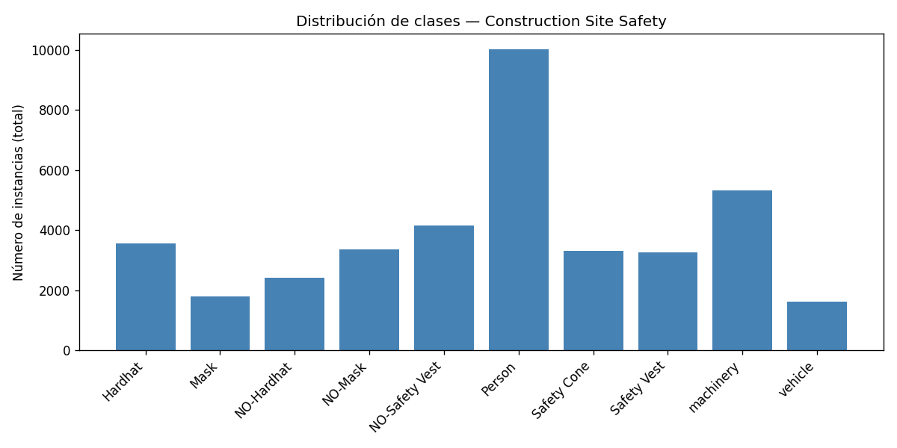
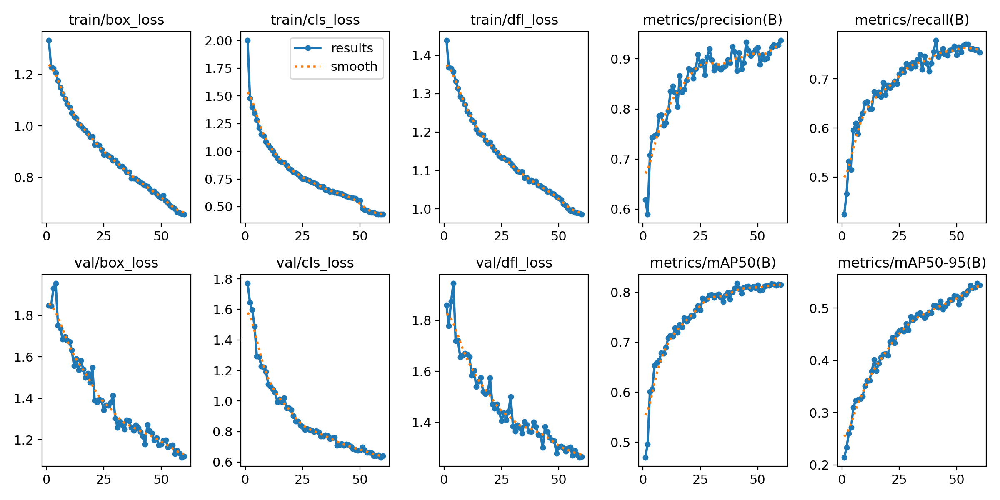
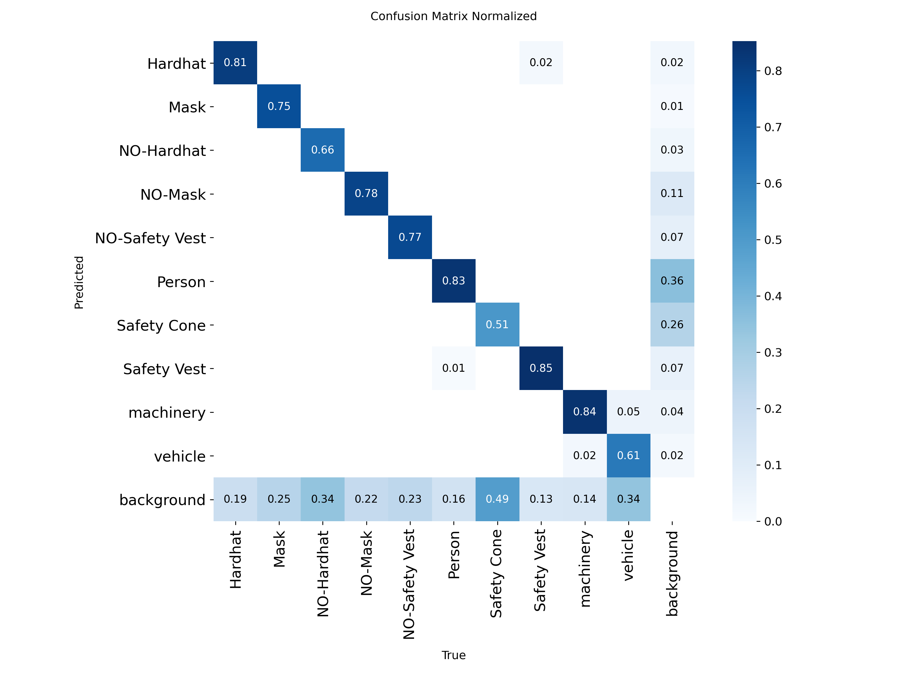
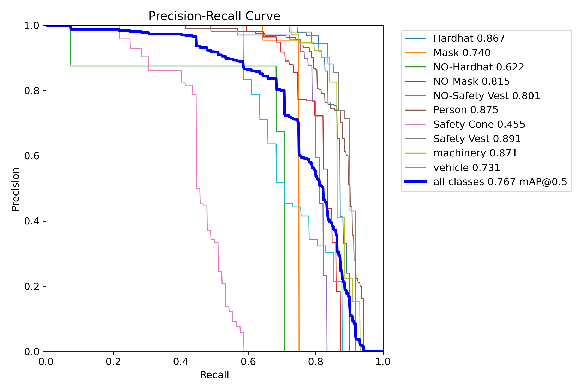
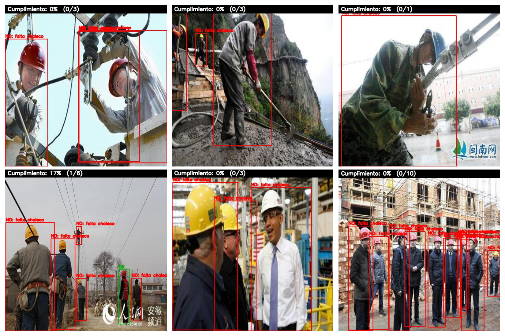
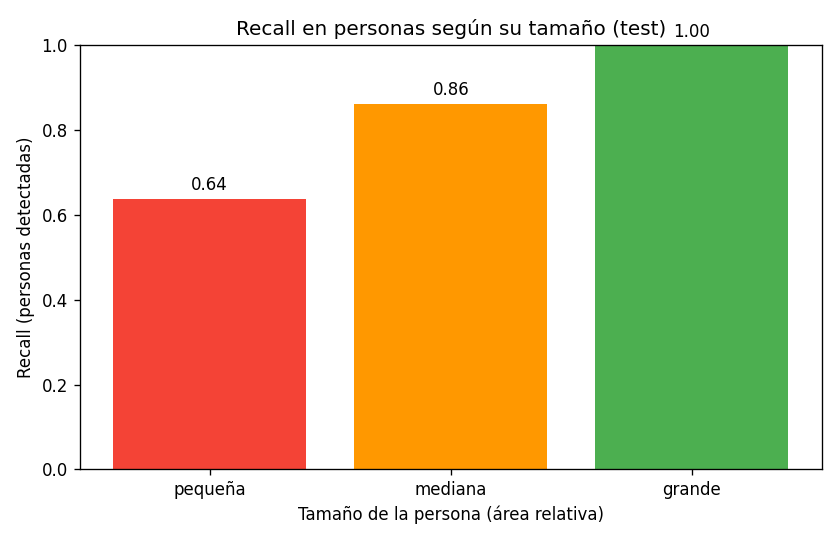

# Detección de Cumplimiento de EPP en Obras de Construcción con YOLOv8

Sistema de visión por computadora que detecta trabajadores y su Equipo de Protección Personal
(EPP) en imágenes de obras, y **verifica el cumplimiento** (casco + chaleco) por persona,
reportando una tasa de cumplimiento por fotograma.

> Examen Parcial — Redes Neuronales y Aprendizaje Profundo. Pregunta 3.

## Dataset

*Construction Site Safety* (Roboflow Universe, CC BY 4.0): 10 clases y 2603 / 114 / 82 imágenes
(train / val / test, partición ya provista). Presenta un fuerte desbalance de clases (6.2x entre
la más y la menos frecuente: `Person` con 10 031 instancias frente a `vehicle` con 1617), lo que
condiciona el aprendizaje de las clases de incumplimiento, que son justamente las más escasas.



## Modelo y entrenamiento

Detector **YOLOv8s** (variante *small*, anchor-free) con *transfer learning* desde COCO. Ajuste
fino (fine-tuning) durante 60 épocas a 640 px de entrada, con data augmentation (mosaic) y early
stopping. Las curvas muestran un entrenamiento estable, sin sobreajuste.



## Resultados principales (conjunto de prueba)

| Métrica | Valor |
|---|---|
| mAP@0.5 | 0.767 |
| mAP@0.5:0.95 | 0.492 |
| Precision | 0.907 |
| Recall | 0.710 |

Clases con mejor desempeño: Safety Vest (mAP50 0.89), Person (0.88), Hardhat (0.87).
Debilidad principal: **objetos pequeños** (Safety Cone 0.46; recall en personas pequeñas 0.64
vs 1.00 en grandes).





## Verificador de cumplimiento

A partir de las detecciones de YOLO, un módulo basado en reglas (`src/compliance_checker.py`)
asocia el EPP a cada persona y decide:

> Una persona **cumple** si tiene casco (Hardhat) en su región de cabeza **y** chaleco (Safety
> Vest) en su torso, sin violaciones (NO-Hardhat / NO-Safety Vest). Criterio conservador
> (pro-seguridad): EPP faltante = no conforme.

Salida: cajas verde (cumple) / rojo (no cumple) + tasa de cumplimiento del fotograma.



## Robustez: hallazgo clave (oclusión vs tamaño)

Se evaluó la robustez ante oclusión partiendo el conjunto de prueba por nivel de solapamiento de
cajas. El recall **no cae** con la oclusión (0.69 / 0.91 / 0.90), un resultado contraintuitivo.
La causa es una **variable de confusión**: el solapamiento de cajas está correlacionado con el
tamaño (las personas muy solapadas suelen ser grandes y cercanas, fáciles de detectar). Al aislar
el tamaño, el patrón es claro: el recall sube de 0.64 (personas pequeñas) a 1.00 (grandes). El
factor real de dificultad es el **tamaño del objeto**, no la oclusión medida por solapamiento.



## Estructura del repositorio

```
.
├── README.md
├── requirements.txt
├── run_all.sh                 # pipeline completo de extremo a extremo
├── .env.example               # plantilla para la API key de Roboflow
├── configs/
├── src/
│   ├── 01_download_dataset.py   # descarga el dataset (Roboflow)
│   ├── 02_analyze_dataset.py    # desbalance de clases
│   ├── 03_visualize_samples.py  # sanity check de anotaciones
│   ├── 04_train.py              # entrena YOLOv8
│   ├── 05_validate.py           # mAP por clase + matriz de confusión
│   ├── 06_predict_images.py     # demo del verificador de cumplimiento (imágenes)
│   ├── 07_occlusion_analysis.py # robustez ante oclusión (recall por persona)
│   ├── 08_size_analysis.py      # robustez ante objetos pequeños
│   ├── 09_predict_video.py      # demo del verificador sobre video
│   └── compliance_checker.py    # módulo: lógica de cumplimiento (importado)
├── notebooks/                 # cuadernos de Google Colab (ver sección Colab)
├── outputs/                   # métricas, figuras, imágenes anotadas (generado)
└── report/figures/            # figuras seleccionadas para el informe
```

## Requisitos

- Python 3.12, GPU NVIDIA recomendada (entrenamiento). Probado en RTX 4070 (8 GB), CUDA.
- Cuenta gratuita de [Roboflow](https://roboflow.com) (para descargar el dataset).

## Instalación

```bash
python -m venv .venv
source .venv/bin/activate          # Windows: .venv\Scripts\activate
pip install --upgrade pip
pip install -r requirements.txt
# Verificar GPU:
python -c "import torch; print('CUDA:', torch.cuda.is_available())"
```

## Configuración (clave de Roboflow)

```bash
cp .env.example .env
# Editar .env y poner tu ROBOFLOW_API_KEY
# (Roboflow -> Settings del workspace -> Roboflow API -> Private API Key)
```

## Ejecución

### Pipeline completo (un solo comando)

```bash
bash run_all.sh
```

Ejecuta en orden: descarga → análisis → entrenamiento → evaluación → demo → análisis de
robustez. El paso de entrenamiento toma ~30 min en GPU.

### Paso a paso

```bash
python src/01_download_dataset.py     # descarga el dataset
python src/02_analyze_dataset.py      # distribución/desbalance de clases
python src/03_visualize_samples.py    # verifica anotaciones
python src/04_train.py                # entrena (genera outputs/training/.../best.pt)
python src/05_validate.py             # métricas en test + matriz de confusión
python src/06_predict_images.py       # demo de cumplimiento en imágenes de test
python src/07_occlusion_analysis.py   # recall por nivel de oclusión
python src/08_size_analysis.py        # recall por tamaño (objetos pequeños)
```

### Inferencia sobre imágenes o video propios

El verificador puede aplicarse a material nuevo (no visto en el entrenamiento):

```bash
# Imágenes del conjunto de prueba (genera outputs/compliance/images/):
python src/06_predict_images.py

# Un video propio: colócalo en data/videos/ y pásalo como argumento.
# data/ no se versiona; cada video produce su propia subcarpeta de resultados.
python src/09_predict_video.py data/videos/obra.mp4
```

La salida de video queda en `outputs/compliance/video/<nombre>/` (video anotado, fotogramas y
un CSV con la tasa de cumplimiento por fotograma).

## Ejecución en Google Colab

En `notebooks/` hay dos cuadernos listos para Colab (activar GPU en *Entorno de ejecución →
Cambiar tipo de entorno → GPU*):

- **`colab_epp_yolo.ipynb`** — clona este repositorio, instala dependencias y ejecuta el
  pipeline completo (o solo la inferencia con un modelo ya entrenado).
- **`colab_epp_yolo_autocontenido.ipynb`** — incluye todo el código fuente embebido; reproduce
  el proyecto de extremo a extremo sin clonar el repositorio.

Ambos requieren una API key gratuita de Roboflow para descargar el dataset.

## Dataset

[Construction Site Safety](https://universe.roboflow.com/roboflow-universe-projects/construction-site-safety)
(Roboflow Universe, v27, licencia CC BY 4.0). 10 clases: Hardhat, Mask, NO-Hardhat, NO-Mask,
NO-Safety Vest, Person, Safety Cone, Safety Vest, machinery, vehicle. ~2,800 imágenes
(train 2603 / valid 114 / test 82).

## Limitaciones

- La asociación EPP→persona es geométrica 2D; no maneja perspectiva ni oclusión total.
- El verificador depende del detector: un EPP no detectado produce un falso positivo de
  no-conformidad.
- La detección de objetos pequeños/lejanos es la debilidad principal (recall ~0.64 en personas
  pequeñas).
- El dataset está curado: las violaciones (NO-EPP) están más representadas que en grabaciones
  reales.

## Modelo

YOLOv8s (Ultralytics), fine-tuning desde pesos COCO. Configuración documentada en `src/04_train.py`.
