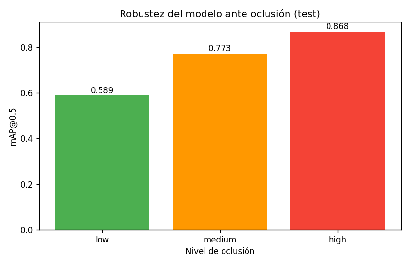

# Detección de Cumplimiento de EPP en Obras de Construcción con YOLOv8

Sistema de visión por computadora que detecta trabajadores y su Equipo de Protección Personal
(EPP) en imágenes de obras, y **verifica el cumplimiento** (casco + chaleco) por persona,
reportando una tasa de cumplimiento por fotograma.

> Examen Parcial - Redes Neuronales y Aprendizaje Profundo. Pregunta 3.

## Revisión de la literatura

La detección automática de EPP en obras de construcción se ubica en la intersección de dos líneas
maduras: la **detección de objetos en tiempo real** y la **seguridad ocupacional asistida por
visión por computadora**. La construcción es uno de los sectores con mayor siniestralidad —las
caídas desde altura concentran más de la mitad de las muertes— y el uso correcto del EPP es una de
las barreras de control más efectivas. Las referencias que sustentan este trabajo se organizan en
dos grupos.

**Fundamentos del detector**

- **Redmon et al. (CVPR 2016)** — *You Only Look Once: Unified, Real-Time Object Detection.*
  Propuso el paradigma YOLO de detección en un solo paso (*single-stage*), base de la familia de
  modelos empleada en este trabajo. Su idea central —tratar la detección como un problema de
  regresión directa sobre una grilla de la imagen— es la que habilita la inferencia a velocidad de
  video, requisito de cualquier sistema de monitoreo de obra.

- **Lin et al. (ICCV 2017)** — *Focal Loss for Dense Object Detection.*
  Identificó el desbalance extremo entre fondo y objetos de interés como la causa principal del bajo
  desempeño en detectores densos, y propuso la *Focal Loss*, que reasigna peso hacia los ejemplos
  difíciles durante el entrenamiento. Es directamente pertinente: el dataset presenta un desbalance
  de **6.2x** entre clases, y las clases de incumplimiento —las más escasas— son las más débiles.
  Por eso se la propone como vía de mejora futura.

**Aplicaciones de detección de EPP en construcción**

- **Wang et al. — *Sensors* (2021)** — *Fast Personal Protective Equipment Detection for Real
  Construction Sites Using Deep Learning Approaches.*
  Evaluó detectores profundos para EPP sobre obras reales y aportó la base estadística que motiva el
  problema: las caídas desde altura concentran más de la mitad de las muertes del sector, y el casco
  reduce hasta un **95%** el riesgo de lesión cerebral grave.

- **Hayat y Morgado-Dias — *Applied Sciences* (2022)** — *Deep Learning-Based Automatic Safety
  Helmet Detection System for Construction Safety.*
  Propuso un sistema de detección automática de cascos con redes convolucionales profundas,
  validando la viabilidad del enfoque para este dominio y complementando la base de siniestralidad.

- **Barlybayev et al. — *Cogent Engineering* (2024)** — *Personal Protective Equipment Detection
  Using YOLOv8 Architecture on Object Detection Benchmark Datasets.*
  Es el trabajo más directamente comparable en arquitectura y tarea: evalúa **YOLOv8**
  específicamente para detección de EPP sobre datasets de referencia y aporta comparaciones de
  desempeño entre variantes del modelo.

- **Wei et al. — *Scientific Reports* (2024)** — *Research on Helmet Wearing Detection Method
  Based on Deep Learning.*
  Estudió estrategias para mejorar la detección de casco bajo oclusión y escala variable, las dos
  limitaciones que el análisis de robustez de este trabajo termina identificando.

**Posición de este trabajo respecto a la literatura**

La mayoría de los trabajos citados se concentra en la **detección de objetos individuales** (casco,
chaleco) y reporta su desempeño mediante mAP por clase, sin un módulo explícito de verificación de
cumplimiento por persona. La contribución de este trabajo es **integrar y hacer explícita** esa
capa: un verificador basado en reglas geométricas que asocia el EPP detectado a cada persona, emite
un veredicto individual y agrega una **tasa de cumplimiento por fotograma**, acompañada de material
visual que permite auditar cada decisión.

## Dataset

*Construction Site Safety* (Roboflow Universe, versión 27, CC BY 4.0) reúne **10 clases** y
**2603 / 114 / 82** imágenes (train / val / test, con la partición ya provista). Su rasgo más
condicionante es un fuerte **desbalance de clases (6.2x)** entre la más y la menos frecuente:
`Person` aparece con **10 031** instancias frente a las **1617** de `vehicle`. Este desbalance no es
un detalle menor —empuja al modelo a aprender bien lo abundante y a descuidar lo escaso—, y lo
escaso coincide con lo más crítico para la seguridad: las clases de incumplimiento (NO-). El dataset
no se incluye en el repositorio; lo descarga `src/01_download_dataset.py`.


## Modelo y entrenamiento

El detector es **YOLOv8s** (variante *small*, *anchor-free*), inicializado por *transfer learning*
desde COCO. El ajuste fino (*fine-tuning*) se realizó durante **60 épocas** a **640 px** de entrada,
con *data augmentation* (mosaic) y *early stopping*. Las curvas de entrenamiento se mantienen
estables y sin señales de sobreajuste: las pérdidas de entrenamiento y validación descienden en
paralelo. Los pesos resultantes (`best.pt`) no se versionan por su tamaño; se regeneran al ejecutar
el entrenamiento.


## Resultados principales (conjunto de prueba)

| Métrica | Valor |
|---|---|
| mAP@0.5 | **0.767** |
| mAP@0.5:0.95 | **0.492** |
| Precision | **0.907** |
| Recall | **0.710** |

El modelo alcanza una **precisión alta (0.907)**: cuando afirma haber detectado un objeto, casi
siempre acierta. El recall, más moderado (**0.710**), anticipa el punto débil que confirma el
análisis posterior. Las clases con mejor desempeño son **Safety Vest (mAP50 0.89)**, **Person
(0.88)** y **Hardhat (0.87)** —los elementos grandes y frecuentes—, mientras que la debilidad
principal está en los **objetos pequeños**: Safety Cone cae a **0.46** y el recall en personas
pequeñas baja a **0.64** frente al **1.00** en personas grandes.


## Verificador de cumplimiento

A partir de las detecciones de YOLO, un módulo basado en reglas (`src/compliance_checker.py`) asocia
el EPP a cada persona y aplica el siguiente criterio:

> Una persona **cumple** si tiene casco (Hardhat) en su región de cabeza **y** chaleco (Safety Vest)
> en su torso, sin violaciones (NO-Hardhat / NO-Safety Vest). El criterio es **conservador
> (pro-seguridad)**: ante EPP faltante, se declara *no conforme*.

La clave del diseño es que **detector y verificador son piezas separadas**: el primero detecta
objetos; el segundo decide cumplimiento. Esta separación mantiene el sistema interpretable —cada
veredicto puede rastrearse hasta las detecciones que lo originaron— y permite ajustar la lógica de
seguridad sin reentrenar la red. La salida es directa de leer: cajas **verdes** para quien cumple,
**rojas** para quien no, más la tasa de cumplimiento del fotograma.

Aplicado al conjunto de prueba (**82** imágenes, de las cuales **60** contienen personas y suman
**194** personas detectadas), el verificador reporta una **tasa global de cumplimiento del 19.6%**
(**38** personas conformes). La cifra es deliberadamente baja porque el dataset sobre-representa las
violaciones de EPP respecto a una grabación real; debe leerse como demostración del mecanismo, no
como una estadística de campo.


## Material de demostración

El repositorio incluye la evidencia completa del verificador:

- **Imágenes anotadas** del conjunto de prueba en `outputs/compliance/images/` (cajas verdes para
  quien cumple, rojas para quien no, con la tasa de cumplimiento por imagen).
- **Tabla de cumplimiento por imagen:** `outputs/metrics/compliance_per_image.csv`.
- **Videos anotados** de obras (vía `src/09_predict_video.py`), cada uno con su tabla de tasa de
  cumplimiento por fotograma.

Este material permite revisar los tres casos de interés: cumplimiento, incumplimiento correctamente
detectado y falso positivo por equipo no detectado.

### Análisis complementario a nivel de imagen (oclusión)

Además del análisis por persona, se estimó la oclusión a nivel de imagen y se midió el mAP@0.5 por
nivel (bajo / medio / alto):



## Robustez: hallazgo clave (oclusión vs tamaño)

El experimento de robustez parte de una hipótesis intuitiva —la oclusión debería degradar la
detección— y termina refutándola. Al partir el conjunto de prueba por nivel de solapamiento de
cajas, el recall **no cae** con la oclusión, sino que se mantiene o incluso sube
(**0.69 / 0.91 / 0.90**). El resultado es contraintuitivo, y la explicación es una **variable de
confusión**: el solapamiento de cajas está correlacionado con el tamaño, porque las personas muy
solapadas suelen ser grandes y cercanas, justamente las más fáciles de detectar. Al **aislar el
tamaño**, el patrón emerge sin ambigüedad: el recall sube de **0.64** (personas pequeñas) a
**1.00** (grandes). La conclusión es que el factor real de dificultad es el **tamaño del objeto**,
no la oclusión medida por solapamiento. Este es el principal aporte metodológico del trabajo y un
recordatorio de cuán fácil es confundir correlación con causa en la evaluación de modelos.


## Estructura del repositorio

```
.
├── README.md
├── requirements.txt
├── run_all.sh                 # pipeline completo de extremo a extremo
├── .env.example               # plantilla para la API key de Roboflow
├── configs/
├── src/
│   ├── 01_download_dataset.py   # descarga el dataset (Roboflow)
│   ├── 02_analyze_dataset.py    # desbalance de clases
│   ├── 03_visualize_samples.py  # sanity check de anotaciones
│   ├── 04_train.py              # entrena YOLOv8
│   ├── 05_validate.py           # mAP por clase + matriz de confusión
│   ├── 06_predict_images.py     # demo del verificador (imágenes)
│   ├── 07_occlusion_analysis.py # robustez ante oclusión
│   ├── 08_size_analysis.py      # robustez ante objetos pequeños
│   ├── 09_predict_video.py      # demo del verificador sobre video
│   └── compliance_checker.py    # módulo: lógica de cumplimiento
├── notebooks/                 # cuadernos de Google Colab
├── outputs/                   # métricas, figuras, imágenes anotadas (generado)
└── report/figures/            # figuras seleccionadas para el informe
```

## Requisitos

- Python 3.12, GPU NVIDIA recomendada (entrenamiento). Probado en RTX 4070 (8 GB), CUDA.

## Instalación

```bash
python -m venv .venv && source .venv/bin/activate
pip install -r requirements.txt
```

## Configuración (clave de Roboflow)

La descarga del dataset requiere una API key de Roboflow (gratuita):

```bash
cp .env.example .env
# editar .env y colocar el ROBOFLOW_API_KEY propio
```

## Ejecución

```bash
bash run_all.sh
```

El script ejecuta el pipeline completo en orden: descarga, análisis, entrenamiento, evaluación,
verificador sobre imágenes y análisis de robustez. También es posible ejecutar cada script por
separado:

```bash
python src/01_download_dataset.py
# ...
python src/09_predict_video.py data/videos/<archivo>.mp4
```

## Ejecución en Google Colab

En `notebooks/` hay cuadernos listos para Colab (activar GPU en *Entorno de ejecución -> Cambiar
tipo de entorno*):

- `colab_epp_yolo.ipynb`: clona el repositorio y ejecuta el pipeline.
- `colab_epp_yolo_autocontenido.ipynb`: incluye todo el código embebido en el cuaderno.
- `colab_epp_yolo_autocontenido_con_prueba.ipynb`: igual que el anterior, más una celda para
  probar el modelo con una imagen propia.

## Limitaciones

- El detector solo reconoce las 10 clases anotadas en el dataset (no incluye arneses, por ejemplo).
- El verificador usa reglas geométricas (regiones de cabeza/torso); puede fallar con poses
  inusuales, perspectivas extremas u oclusión severa.
- Las clases de incumplimiento (NO-) y los objetos pequeños son los más débiles.
- El análisis se basa en una sola corrida de entrenamiento (semilla fija); no se reportan
  intervalos de confianza sobre múltiples corridas.

## Conclusiones y recomendaciones

### Conclusiones

- El sistema **YOLOv8s + verificador de reglas** resuelve la tarea propuesta de extremo a extremo:
  detecta a las personas y su EPP con buena calidad (**mAP@0.5 = 0.767**, **precisión = 0.907**) y
  traduce esas detecciones en un veredicto de cumplimiento interpretable y auditable por persona.
- La separación entre **detección** y **verificación** demostró ser una decisión de diseño acertada:
  permite explicar cada veredicto y modificar la política de seguridad sin reentrenar el modelo.
- El principal hallazgo no es una métrica, sino un **resultado metodológico**: lo que parecía
  fragilidad ante la oclusión era, en realidad, un efecto del **tamaño del objeto** actuando como
  variable de confusión. El factor que gobierna la dificultad es el tamaño, no el solapamiento.
- La debilidad genuina del modelo está acotada y es coherente con la literatura: **objetos pequeños
  o lejanos** (recall **0.64** en personas pequeñas) y **clases de incumplimiento escasas**, ambas
  consecuencia del desbalance del dataset.

### Recomendaciones

- **Objetos pequeños:** elevar la resolución de entrada (p. ej. 1280 px) o aplicar inferencia por
  *tiling* para recuperar detecciones lejanas, la principal fuente de error.
- **Desbalance de clases:** incorporar *Focal Loss* (Lin et al., 2017), reponderación por clase u
  *oversampling* dirigido a las clases NO- para fortalecer la detección de incumplimientos.
- **Verificador:** sustituir progresivamente las reglas geométricas 2D por asociación basada en
  estimación de **pose**, de modo de tolerar mejor las poses inusuales y la oclusión parcial.
- **Validez estadística:** repetir el entrenamiento con varias semillas y reportar **intervalos de
  confianza**, en lugar de una única corrida.
- **Validación en campo:** evaluar sobre grabaciones reales de obra, dado que el dataset actual
  sobre-representa las violaciones de EPP y no refleja la distribución operativa.
- **Despliegue:** medir el rendimiento en **FPS** sobre el hardware objetivo y, para escenarios de
  borde (*edge*), valorar la variante más liviana **YOLOv8n** según el compromiso precisión/latencia.
